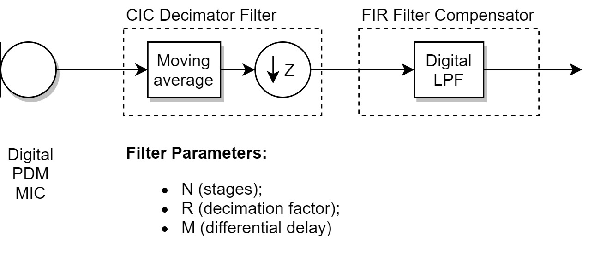
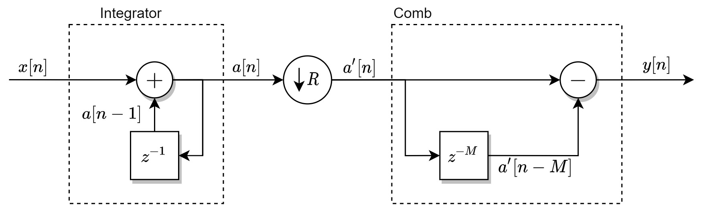
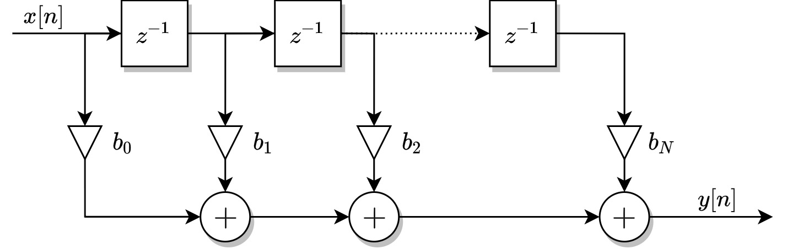
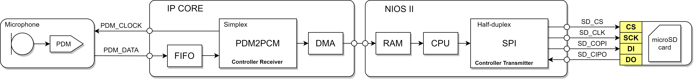

# HDL4PDM2PCM

Hardware described PDM to PCM interface focused in digital microphones.

## PDM to PCM conversion

The main focus on this IP core is to develop an hardware embedded PDM to PCM conversion aiming at computational efficiency.

The figure 1 illustrates the basic architecture for the PDM to PCM conversion (PDM2PCM covnersion, for short). First the high frequency PDM signal is decimated by a CIC decimatior filter with custom pararmeters. Its output is fed to a digital low-pass FIR filter operating at low sample rate that compensates for the CIC response. In the course of development the compensator might me enhanced with more stages or more efficient architectures.

Figure 1 - PDM to PCM conversion pipeline.

    

The figures 2 and 3 respectively illustrates the CIC and FIR filter absic architecture.

Figure 2 - CIC decimator basic architecture.

    

Figure 3 - FIR filter basic architecture.

    

## System

The overall system that implements the PDM2PCM conversion should be able to interface the microphone input signal correctly and deal with the converted signal to some other source.

At first the system architecture for the given system is illustrated by the figure 4. The PDM2PCM interface in a SPI like communication with input data and clock lines acquires the PDM data from the digital microphone. The conversion's output is stored directly into memory (RAM) by a DMA like controller. Then the NIOS II processor (CPU) stores the data as desired. 

Figure 4 - Hardware interfaces for the PDM2PCM system.

    

The figure 4 proposes that the processor summons a SPI interface with a SD card to store the data. But the data's output could be dealt with a DAC feeding a speaker if the user wants to listen to the microphone processed audio.
